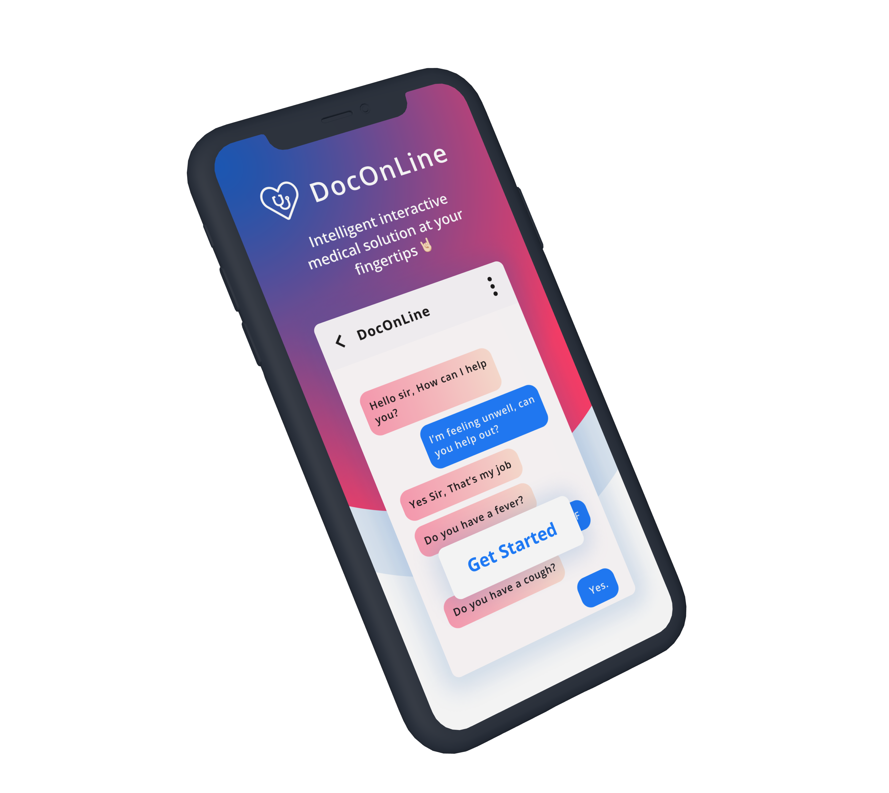
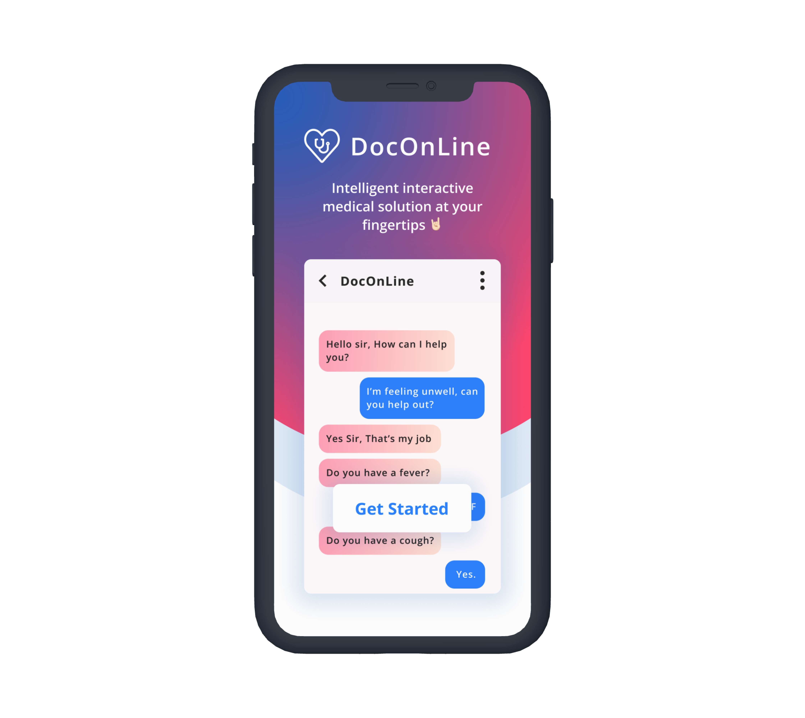
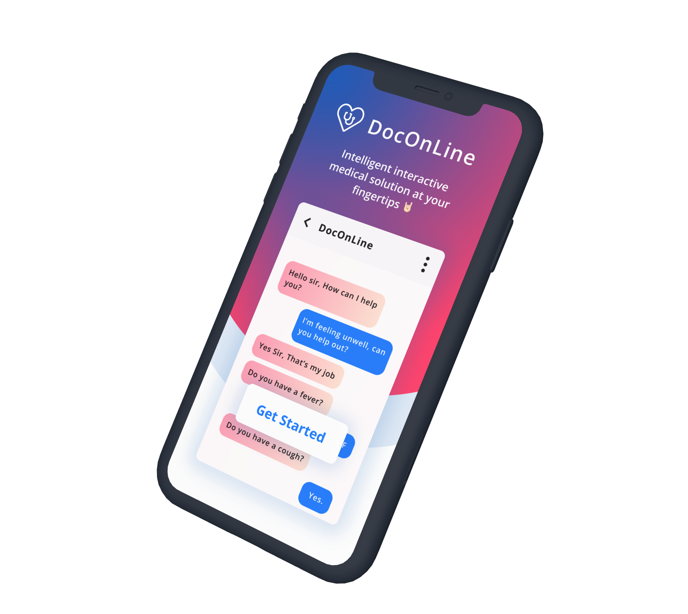
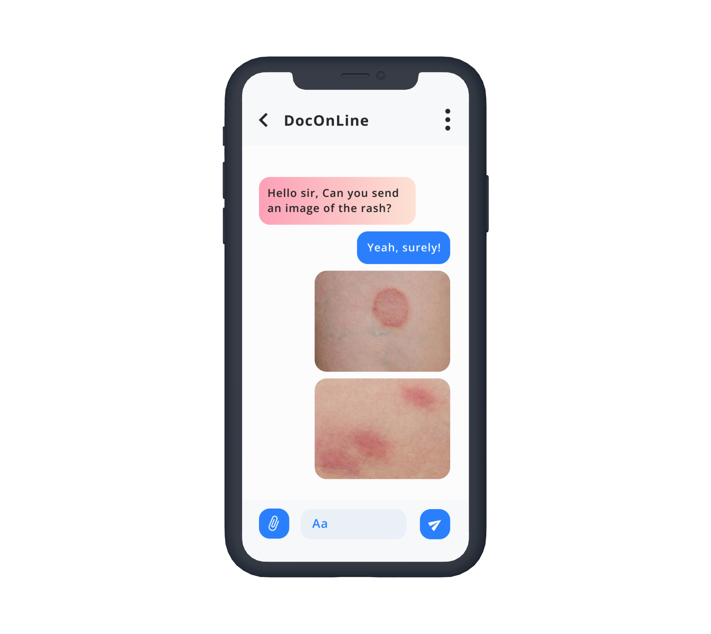
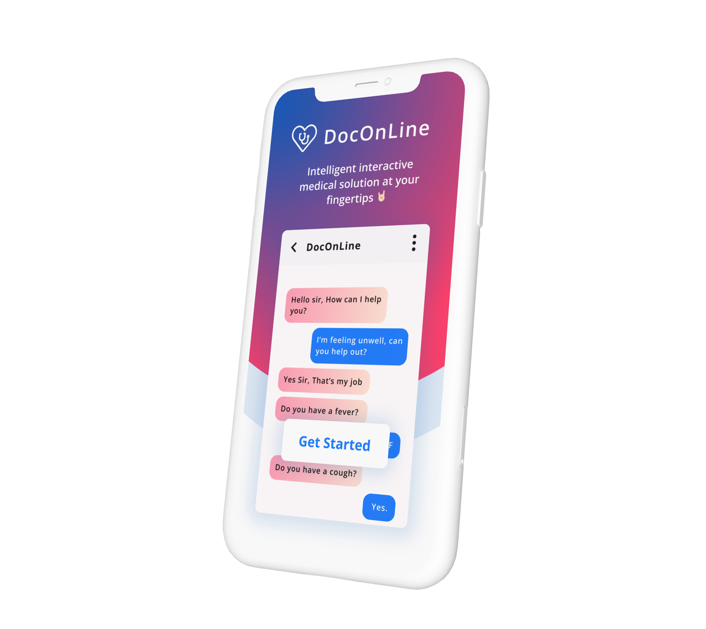

# GE-Precision-Health-Challenge-2021-22

<h1>DocOnLine</h1>
  

## Mockups

<!-- 
 -->

<!-- 

 -->

<h1>❓ Problem Statement </h1>

The pandemic put enormous strain on the whole medical system, pushing doctors to their limitations as they tried to treat patients in an atmosphere where there were already insufficient doctors. Medical chatbots have a significant influence on medical culture. It has a higher level of dependability and is less susceptible to human mistake. People nowadays are more likely to be addicted to technology, yet they are unconcerned about their own health. They avoid seeking medical attention for minor concerns that might turn into a severe ailment in the future. This issue is fixed by the given solution. The concept is around developing a chatbot that is both free and available at all times of the day. The fact that the bot is inexpensive and can be accessible from anywhere. It eliminates the costs of contacting doctors. Given the scarcity of physicians, a medical chatbot that predicts a spectrum of illness based on the user's symptoms is required.  ​

 

<h1>🚀 Our Aim </h1>

DocOnline is an interactive medical solution that aims to be the point of first contact in a medical environment for the potential patient. With the onset of the disastrous pandemic, Covid – 19, the time of medical professionals is made much more valuable and we want to ensure that that this time spent saving as many lives as possible.​

DocOnline gives proper direction to the uninformed patient, so that he/she is well prepped before meeting the medical professionals.

Our platform can tackle a wide array of scenarios, ranging from telling the patient about vitamin deficiencies to analyzing chest X – rays of Covid infected individuals.​

 

# 🖌️ Tools and Technologies used

### DocOnLine is a Progressive Web App(PWA) accessible through any browser or device. The following technologies would be used to develop the app:​

- vanilla JS, HTML and custom CSS ​
- Flask​
- NLTK​
- Tensorflow/Keras​
- Docker​

​
